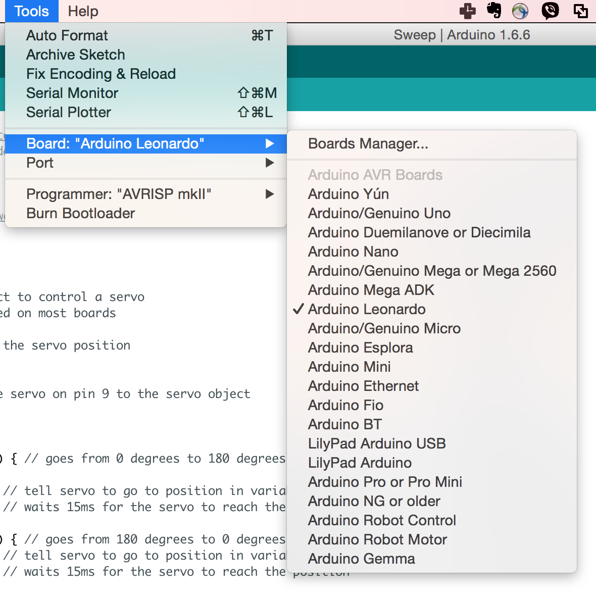
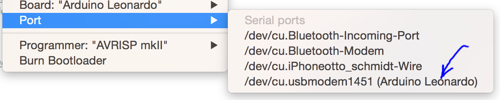
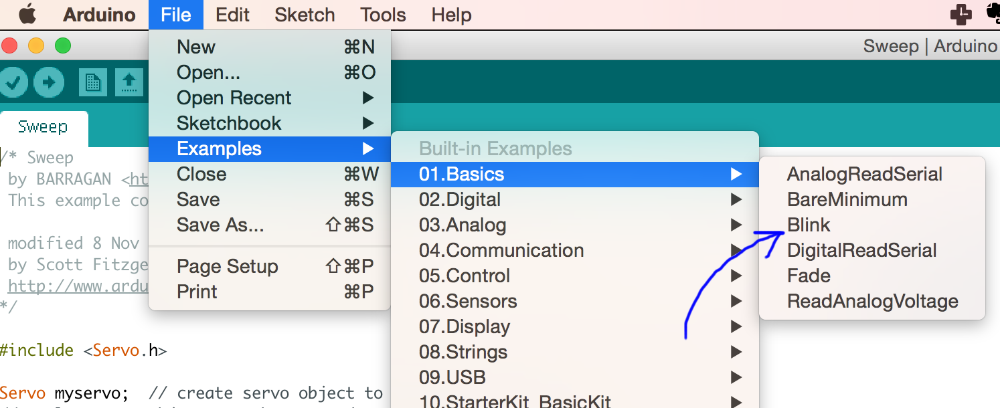
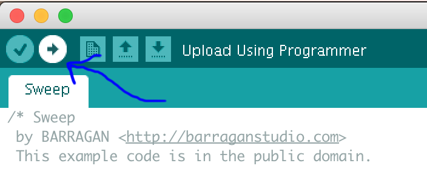
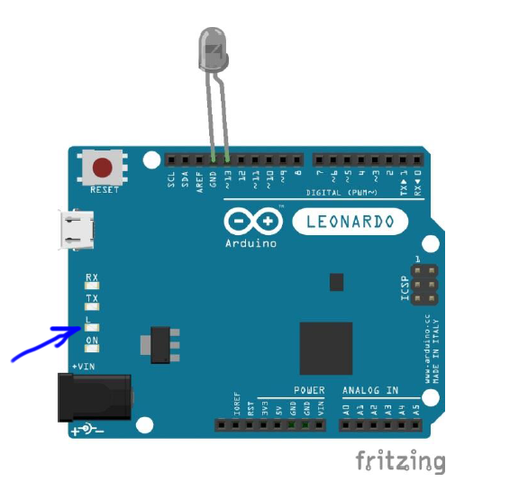

# Твоє майбутнє в його руках

# Як з домашкою?
1. Список із 5 компонентів які ти знаєш, але яких немає немає в 123d.circuits.io (кнопка Components і внизу вкладка), шукати можна на uamper.com,arduino-ua.com і просто в гуглі. Приведи по два приклади застосування цих компонентів в житті чи своїх проектах
2. Для чого в серво моторі є потенціометр? ([Приклад запиту в гугл](https://www.google.com.ua/search?hl=en&btnI=I%27m+Feeling+Lucky&pws=0&q=%D1%81%D0%B5%D1%80%D0%B2%D0%BE%D0%BC%D0%BE%D1%82%D0%BE%D1%80+%D0%BF%D0%BE%D1%82%D0%B5%D0%BD%D1%86%D1%96%D0%BE%D0%BC%D0%B5%D1%82%D1%80&gws_rd=cr,ssl&ei=kRzbVpvnKK3b6QSZyqPACw) - всі маленькі неважливі слова викинуті)
3. Пояснити, чому коли натискається кнопка [на схемі](https://123d.circuits.io/circuits/1714999-the-unnamed-circuit/edit#breadboard) (не забудь спочатку натиснути Start simulation), то два світлодіода горять, а якщо кнопка не натиснута, то один з них перегоряє? (можна використовувати тут наших вівців і собак)
4. Середня нога [на схемі з потенціометром](https://123d.circuits.io/circuits/1714763-the-unnamed-circuit/edit#breadboard) це плюс чи мінус? (також рекомендую зробити Start simulation і подивитися на еффект крутіння потенціометра)

## Повідмічаємо щоб знати кому з чим треба допомога
[Список](https://docs.google.com/spreadsheets/d/1I_pa0SVOwD4do1cLmvH-YibkLiffA0yMeUnzqyNJ7nQ/edit#gid=0)

# Додаткови сценарії
## Чи можна якось дізнатися теперішнє положення серва? Нащо це треба?

[Пацани пробували](https://habrahabr.ru/company/amperka/blog/127773/)

## Що буде якщо викрутити потенціометр? Нащо це треба?

# Хто пам'ятає формулу для закону Ома?

## Мнемонічне правило

### Чому I ?

Intensity!

### Чому R ?

### Чому U ?

# Нащо я все це вам розказую?

# Перше правило Кирхгофа
Фізичний закон завдяки якому кнопка [на схемі](https://123d.circuits.io/circuits/1714999-the-unnamed-circuit/edit#breadboard) рятує світлодіод від перегоряння.

# Вікторина
## Жора

## Андрійко-Марійко

## Густаф

## Сашко (Жузеппе Антоніо Анастассіо)

# Наближаємося до практичної частини

1. Нащо нам третій дріт?
2. Що передається на ньому?
3. Як би ти передавав/передавала команду, на скільки повернутися?
4. Так щоб довжина дроту не впливала?

Відяшка на випадок я прийду без осцилографа

## ШIМ (Широтно Імпульсна Модуляція)
По простому: ми передаємо імпульси скількись там раз на секунду (наприклад 50). Ширина цих імпульсів показує, наскільки треба повернутися.

## Де це ще використовується?

# Час збирати всьо докупи

[https://www.arduino.cc/en/Tutorial/Sweep](https://www.arduino.cc/en/Tutorial/Sweep)

# Level up! (Для найшвидших)
[https://www.arduino.cc/en/Tutorial/Knob](https://www.arduino.cc/en/Tutorial/Knob)

# Перевіримо що воно взагалі робоче
## 1. Втикнути ардуїно

## 2. Вибрати тип

## 3. Вибрати порт

## 4. Завантажити трохи коду

## 5. Залити його на ардуїно

## 6. Діод має блимати

