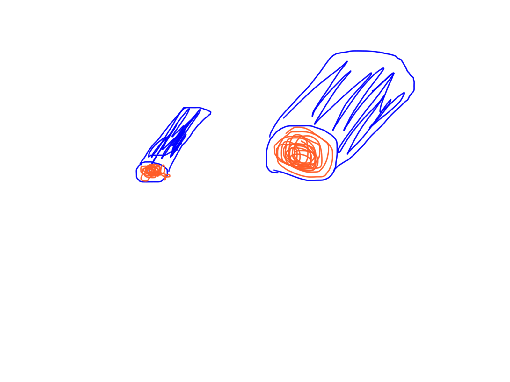
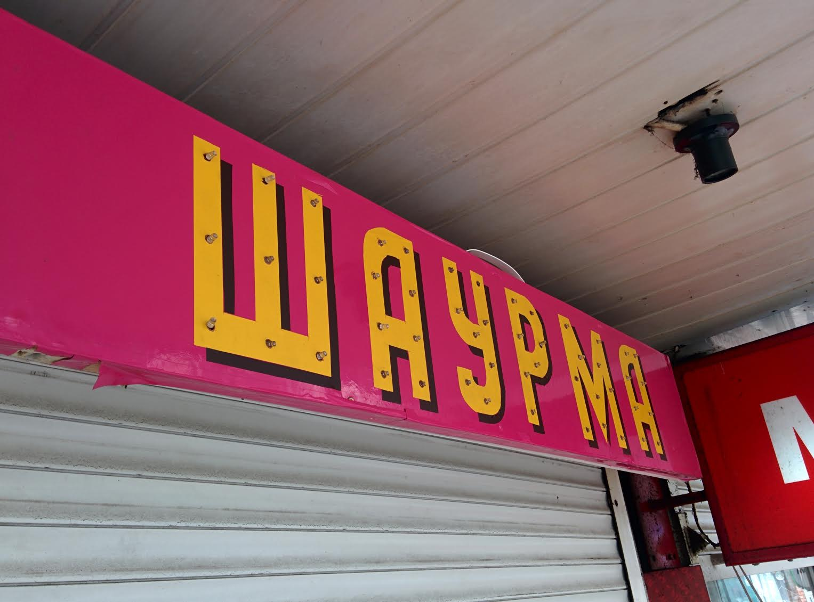

# Почнемо з найголовнішого
* 2 квітня презентуємо проекти

* 26 у нас вихідний

* 2 квітня я останній день читаю лекції в GoITeens, проектні питання можна і після того

# Друге найголовніше

## Три закони роботехніки
* Робот не може заподіяти шкоду людині, або своєю бездіяльністю дозволити, щоб людині була заподіяна шкода;
* Робот повинен підкорятися наказам людини, за винятком тих, котрі суперечать першому пункту;
* Робот повинен захищати самого себе, якщо тільки його дії не суперечать першому і другому пунктам.

# Як з домашкою?
9. Серед слайдів на гітхабі знайди два приклади які відносяться до ШИМ (англійською PWM) та надішли їх сюди у відповіть (правою клікнути -> Copy Image потім тут в листі зробити Paste)

2. Порахувати кількість портів для землі (Ground) на платці
3. Порахувати кількість портів для живлення 3.3 вольти на платці
6. Які є дві головні функції в arduino по аналогії з processing?
6. Яка з них запускається один раз на початку програми?
6. Яка з них повторюється нескінченну кількість разів?
10. Які номери портів в тебе на ардуїнці підтримують ШИМ?

7. Придумати як підключити ще один сервомотор, намалювати схему на 123d.circuits.io і надіслати мені посилання
8. Модифікувати програму Sweep для підтримки ще одного серво мотору

1. Чи вийшло поблимати і якщо нє - які проблеми
4. Що зміниться в програмі Sweep якщо ми підключимо сигнальний провід мотора до 10ого піна, а не до 9ого
5. Для чого функція delay і що трапиться якщо ми її приберемо з програми взагаллі
9. Серед слайдів на гітхабі знайди два приклади які відносяться до ШИМ (англійською PWM) та надішли їх сюди у відповіть (правою клікнути -> Copy Image потім тут в листі зробити Paste)

## Повідмічаємо проблеми

# З минулих разів
* Перше правило Кіргофа буквами?
* Що з них що?
* Закон Ома буквами?
* Що з них що?
* Хто пам'ятає що таке PWM / ШИМ?
* За допомогою якого приклада можна побачити ШИМ графік?
* Що знаходиться по його осям?
* Чому ШИМ краще використовувати для передачі чисел, а не рівень напруги?
* Який з провідників має менший опір?

(Тут час згадати про овець)

# Волти, Ампери, Оми, Кірхгофи - Що я від вас досі ховав?

## Як це зв'язано з іншими штукми?

# Вікторина
Дві команди, 5 хвилин на підготовку, компоненти + приклади їх використання

# Новеньке
## digitalRead / digitalWrite, analogRead / analogWrite
* Бачили analogRead?
* Як думаєте працює analogWrite?
* В чому відмінності з PWM який генерує analogWrite з тим що використовується для керування сервомоторами?
* Що на вольтметрі побачиш після digitalWrite?
* Для чого може використовуватися analogWrite?

* Що поверне digitalRead якщо на піні 3.3 вольти з 5 можливих? А якщо 1.5?

* Shields

# Приклади
https://www.arduino.cc/en/Tutorial/BuiltInExamples
https://www.arduino.cc/en/Reference/Tone

# Практичне
## Хто прийшов без девайсів - підніміть руки
* Хто хоче їх прийняти?

## Сьогодні

# Далі - проектне

# Домашка
* Для чого map?
