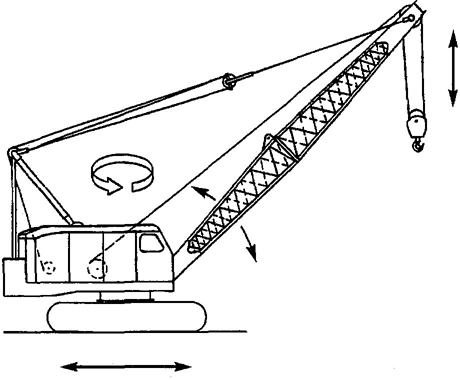

# Базовий опис проекта
* Назва
* Трохи тексту для загального опису
* Функції (шматки які можна робити ізольовано одне від одного)
* Деталі (з яких готових компонентів будеш це збирати)
 * Залізячні компоненти можна подивитися на [arduino-ua](http://arduino-ua.com), [uamper](http://uamper.com)
* З чим тобі потрібна допомога

[Приклад опису](https://docs.google.com/document/d/1S9h5L1MT7Uv-vZGNc8nPmWnsFPuWcAS-p-rk_JTb82U/edit)

# Приклади для натхнення
## Залізячні
* Машинка на радіокеруванні з хватальним маніпулятором
* Туррель яка наводиться на того хто заходить в комнату
* Звукова перчатка
* Твістер для пальців
* Ультразвукова лінійка/дальномір
* Сортувальник M&Mсів по кольору
* Самовикидальні кігті як в Росомахи
* Скринька для речей з паролем / доступом по картці RFID 
* Колесо-вирощувалка для рослин, типу [Omega garden](https://www.youtube.com/watch?v=5QefgR5YbvU)
* Ще приклади є на [instructables](http://instructables.com)
* [Світильник який вимикається\вмикається хлопком рук](http://www.instructables.com/id/Clap-Switch-1/)
* [Планка для селфі що створює еффект руху](https://www.youtube.com/watch?v=x0Iv1eszOV4)
* [Непідйомний молот](https://www.youtube.com/watch?v=0_8Xhzt5YQI)

## Програмні
* Персональний вебсайт, наприклад [swiftbricks.com](https://swiftbricks.com)
* Аплікуха для телефона, наприклад [ікони](https://play.google.com/store/apps/details?id=com.relidget)
* Створений тобою сервак Minecraft на якому ми всі можемо пограти, моди для нього
* Танчики для двох гравців на processing
* Підбадьорювалка

